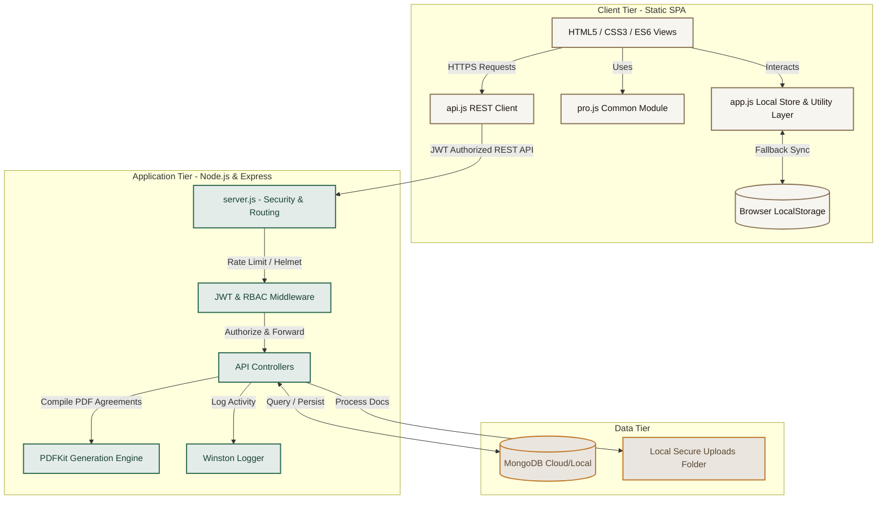
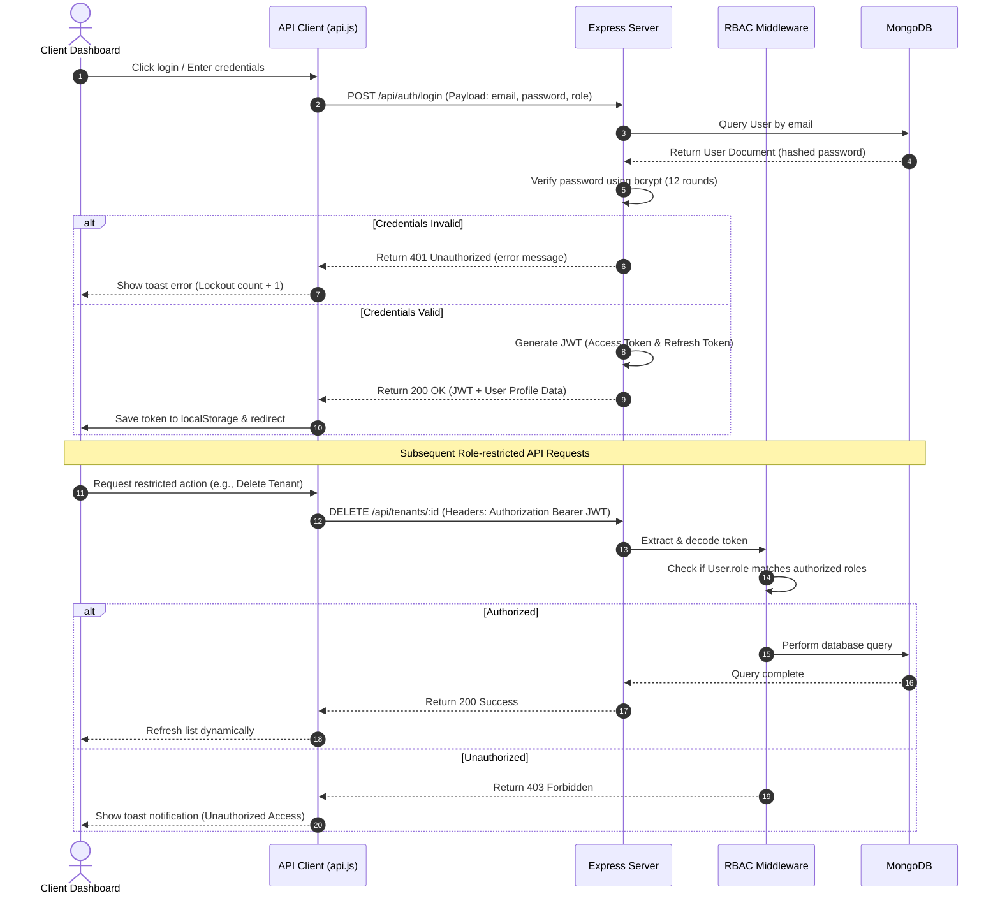
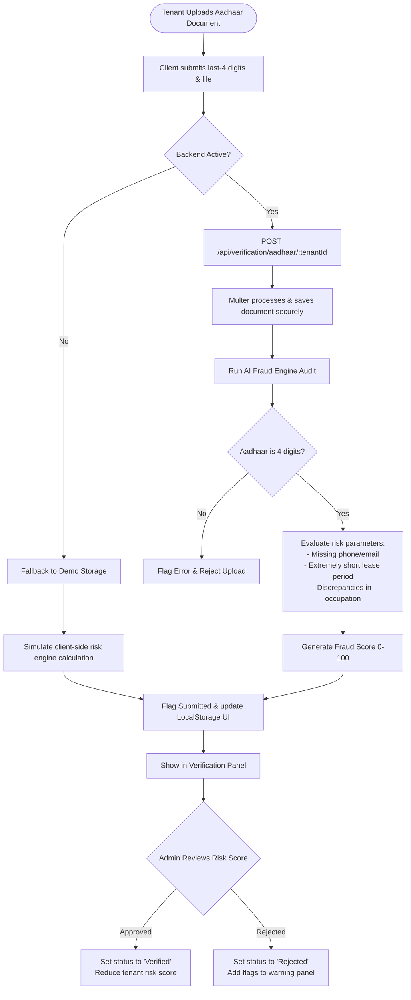

# Rental PM Pro — Production-Grade Property Management Platform

> A highly scalable, full-stack rental property management platform designed with a warm, premium aesthetic. Features multi-role authentication, Aadhaar verification, AI-powered fraud risk scoring, lease agreement generation, secure document vaults, real-time simulated chat, and interactive financial analytics.

---

## 📁 Project Structure

```
rental-pm-pro/
├── frontend/                        # Pure HTML/CSS/JS frontend (works offline)
│   ├── index.html                   #  Dashboard (original + Chart.js revenue graph)
│   ├── properties.html              #  Property management (original)
│   ├── tenants.html                 #  Tenant management (original)
│   ├── payments.html                #  Payment tracking (original)
│   ├── maintenance.html             #  Maintenance tickets (original)
│   ├── login.html                   #  NEW — Multi-role auth (JWT + demo mode)
│   ├── leases.html                  #  NEW — Lease management + PDF generation
│   ├── analytics.html               #  NEW — Admin analytics dashboard (Chart.js)
│   ├── verification.html            #  NEW — Aadhaar verification + AI fraud detection
│   ├── documents.html               #  NEW — Secure document vault (grid/list view)
│   ├── notifications.html           #  NEW — Smart notifications center
│   ├── chat.html                    #  NEW — Real-time tenant ↔ owner messaging
│   ├── data.json                    # Seed data (original)
│   ├── css/
│   │   ├── style.css                # Original styles (untouched)
│   │   └── pro.css                  #  NEW — All production upgrade styles
│   └── js/
│       ├── app.js                   #  Original app logic (untouched)
│       └── modules/
│           ├── api.js               #  NEW — REST API client with JWT
│           └── pro.js               #  NEW — Sidebar, pagination, shared utilities
│
└── backend/                         # Node.js + Express REST API
    ├── server.js                    # Entry point (Helmet, CORS, rate limiting)
    ├── package.json
    ├── .env.example                 # Copy to .env and fill in values
    ├── .gitignore
    ├── models/
    │   ├── User.js                  # User model with role-based access
    │   └── index.js                 # Property, Tenant, Payment, Maintenance,
    │                                #   Lease, Document, Notification, ChatMessage
    ├── controllers/
    │   ├── authController.js        # Register, login, logout, profile, password
    │   ├── analyticsController.js   # Dashboard KPIs, revenue charts, property perf
    │   ├── leaseController.js       # CRUD, PDF generation (PDFKit), e-signature
    │   └── verificationController.js# Aadhaar submit/approve/reject + AI fraud score
    ├── middleware/
    │   ├── auth.js                  # JWT protect + role authorize
    │   └── errorHandler.js          # Centralized error handling
    ├── routes/
    │   ├── auth.js
    │   ├── properties.js
    │   ├── tenants.js
    │   ├── payments.js
    │   ├── maintenance.js
    │   ├── leases.js
    │   ├── documents.js             # Multer file upload
    │   ├── notifications.js
    │   ├── analytics.js
    │   └── verification.js
    └── utils/
    │   ├── logger.js                # Winston logger (console + file)
    │   └── seed.js                  # MongoDB seed script
    └── uploads/                     # Secure local folder for files
```

---

##  System Architecture

Rental PM Pro is designed with a decoupled **Client-Server (Full-Stack) Architecture** that provides high resilience. If the central database is offline, the client seamlessly falls back to a high-fidelity **Offline Demo Mode** leveraging browser `localStorage` and seed files, ensuring zero downtime for client-side evaluation.



---

##  Core Workflows & Flowcharts

### 1. Multi-Role Authentication & Access Control
A secure role-based access pipeline checks user credentials, generates standard JSON Web Tokens (access + refresh tokens), and restricts server-side API access based on the user's role: **Admin**, **Owner**, **Tenant**, or **Staff**.



### 2. Aadhaar Upload & AI Fraud Risk Scoring Flow
A secure compliance pipeline for tenant screening. It parses and validates uploaded documents, runs a local multi-variable risk audit engine to score the tenant (0–100), flags alerts, and queues details for Admin review.



---

##  Quick Start

### Option A — Frontend Only (No Server Needed)
Open `frontend/index.html` in any browser. The app works fully in **demo mode** using `localStorage` for all data — no backend or database required.

* **Demo Login:** Open `login.html` → Click any **Quick Demo** button (Admin, Owner, Tenant) to populate credentials automatically.

### Option B — Full Stack with Backend

#### Prerequisites
* Node.js 18+
* MongoDB 6+ (Optional: the backend automatically runs in database fallback mode if MongoDB is not active)

```bash
# 1. Backend setup
cd backend
cp .env.example .env        # Generates environmental configs
npm install                 # Installs dependencies
node utils/seed.js          # Seeds the database with sample records
npm run dev                 # Launches Express API at http://localhost:5000

# 2. Frontend setup
cd ../frontend
npx serve -l 3000           # Launches the static server at http://localhost:3000
```

---

##  Demo Credentials

| Role   | Email                    | Password      |
|--------|--------------------------|---------------|
| **Admin**  | `admin@rentalpm.com`       | `Admin@123456`  |
| **Owner**  | `owner@rentalpm.com`       | `Owner@123456`  |
| **Tenant** | `tenant@rentalpm.com`      | `Tenant@123456` |

---

##  Features Implemented

###  Multi-Role Authentication
* JWT access tokens + refresh tokens.
* Roles: **Admin**, **Owner**, **Tenant**, **Staff**.
* Account lockout mechanism (protects accounts after 5 failed attempts with a 15-minute lock).
* Secure password hashing using `bcryptjs` (12 rounds).

###  Aadhaar-Based Tenant Verification
* Submit the last-4 digits of Aadhaar (UIDAI compliant — no full numbers stored in compliance with privacy acts).
* Secure uploaded file storage and document tracking.
* Admin panel to approve or reject submitted applications.

###  AI Fraud Risk Detection
* Automated fraud risk scoring (0–100) per tenant.
* Variables monitored: unverified Aadhaar, missing contact nodes, suspicious occupation, and high-risk short lease profiles.
* Alerts triggered dynamically for high-risk scores ($\geq50$).

###  Lease Agreement Management
* Create, manage, sign, and terminate agreements.
* High-quality lease PDF generation via `PDFKit` with e-signatures, clauses, and metadata embedded.
* Automated renewal alert queues generated 30 days before expiration.

###  Analytics Dashboard
* Dynamic revenue trend charts (6-month line graph).
* Occupancy distribution (doughnut chart).
* Maintenance ticket categories (bar chart).
* Property financial return-on-investment collection lists with progress indicators.

###  Secure Document Vault
* Toggleable Grid/List views.
* Multer-powered document categorization (Aadhaar, PAN, Lease, Receipt, NOC).
* Scoped visibility: Public, Property-Scoped, or Admin-Only private documents.

---

##  Security Architecture

| Security Layer | Implementation Detail |
|---|---|
| **Authentication** | JWT (JSON Web Tokens) with distinct Access and Refresh lifetimes. |
| **Password Hashing** | Cryptographically salted hashes using `bcryptjs` (12 rounds). |
| **RBAC** | Server-side Express routing middleware that intercepts and validates roles. |
| **Request Throttling** | `express-rate-limit` (200 requests/15m globally, 10 requests/15m for auth). |
| **HTTP Headers** | `helmet` configured with strict Content Security Policies (CSP). |
| **Cross-Origin (CORS)** | Configured to allow secure, credentialed client-requests from origin. |
| **XSS Prevention** | Body sanitizer middleware (`xss-clean`) + HTML output sanitization. |
| **Error Handling** | Global exception handler (logs traces server-side, hides them from clients). |
| **Data Minimization** | Compliance audits: Last 4 digits of Aadhaar recorded, never the full number. |

---

##  API Endpoints

```text
POST   /api/auth/register            # Register user
POST   /api/auth/login               # Authenticate and receive JWT
POST   /api/auth/me                  # Get current authenticated user profile
POST   /api/auth/logout              # Terminate session

GET    /api/properties               # Get properties list (CRUD available)
GET    /api/tenants                  # Get tenant database (CRUD available)
GET    /api/payments                 # Get payments records (CRUD available)
PATCH  /api/payments/:id/status      # Mark a payment status as Paid / Overdue

GET    /api/maintenance              # Get maintenance requests
POST   /api/maintenance/:id/note     # Add note to ticket
POST   /api/maintenance/:id/escalate # Escalate priority status

GET    /api/leases                   # Get leases list
GET    /api/leases/:id/pdf           # Generate and download lease agreement PDF
PATCH  /api/leases/:id/sign          # Apply tenant or owner e-signatures

POST   /api/documents/upload         # Upload file to Vault (multipart/form-data)
GET    /api/documents                # Retrieve uploaded documents
DELETE /api/documents/:id            # Delete a document from server

GET    /api/notifications            # Get all notification queue messages
PATCH  /api/notifications/read-all   # Mark all notifications as read

GET    /api/analytics/dashboard      # Fetch KPI blocks & charts datasets
GET    /api/analytics/payments       # Monthly trends per fiscal year

POST   /api/verification/aadhaar/:id # Submit tenant Aadhaar details
PATCH  /api/verification/approve/:id # Approve tenant verification
PATCH  /api/verification/reject/:id  # Reject tenant verification

GET    /api/health                   # Service status and health monitoring
```

---

## 📈 Areas of Improvement & Future Roadmap

To move Rental PM Pro to a multi-tenant, cloud-scale SaaS application, the following enhancement areas should be prioritized:

### 1. Backend Architecture & High Availability
* **Database Scaling**: Implement read-replicas for MongoDB and migrate local storage to an enterprise-grade DBMS (like PostgreSQL) for high-integrity transaction operations.
* **Asynchronous Processing (BullMQ & Redis)**: Offload high-resource operations (like PDF generation, email dispatches, and Aadhaar risk scoring) from the main event-loop onto a background queue system powered by **Redis** and **BullMQ**.
* **Microservices**: Decouple the monolithic Express router, separating Auth/Verification, Analytics, and Document Management into independent, containerized Docker microservices.

### 2. High-Grade Security & Vault Isolation
* **Zero-Knowledge Aadhaar Storage**: Migrate uploaded identity documents to an isolated, secure object store (like AWS S3 with KMS server-side encryption) and utilize **Presigned URLs** with transient access timers.
* **True Third-Party ID Verification**: Integrate with official UIDAI-certified Aadhaar/PAN validation APIs (such as Digilocker, Sandbox, or Karza) rather than metadata-based audits.
* **HTTP-Only Session Cookies**: Rather than saving JWTs in browser `localStorage` (which is vulnerable to XSS injection), store access and refresh tokens in secure, partitioned `HttpOnly`, `SameSite=Strict` cookies.

### 3. Front-End Enhancements & UX Polish
* **Reactive State Management**: Migrate the custom vanilla DOM updates to a structured React or Vue architecture utilizing centralized state management (Redux, Pinia, or Zustand) for a single source of truth across views.
* **Real-time WebSockets**: Upgrade the simulated chat rooms to real-time messaging pipelines using **Socket.io** backed by Redis adapter clusters.
* **Optimistic UI Updates**: Implement optimistic UI rendering patterns on buttons (like marking payments or registering agreements) to make all interaction elements respond instantaneously before server updates complete.
* **Progressive Web App (PWA)**: Support full service-worker caching to store application templates and local databases, making the fallback offline demo mode run perfectly without network access.
